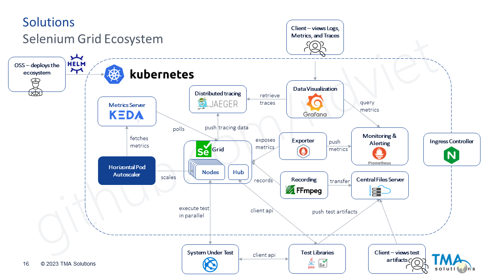

This umbrella chart is created to deploy my motivation for Autoscaling Selenium Grid on Kubernetes, details as below



More details on my motivation are mentioned in the presentation [here](docs/Topic_Scalable-Parallel-AT_Publish.pdf).

## System requires

1. Maven (Tested version 3.8.6)
2. Helm v3 (Tested version v3.11.3)
3. Kubernetes (Tested version v1.25.5 - Runtime: Docker v20.10.24 - Provisioned by Minikube v1.26.1)

Noted: At the moment, chart supports PersistenceVolume on local HostPath only. Other types of PV will be added later.

## Install the chart

```shell
# Add ndviet helm repository
helm repo add ndviet https://www.ndviet.org/charts

# Update charts from ndviet repo
helm repo update

# List all versions present in the ndviet repo
helm search repo ndviet/scalable-selenium-grid --versions

# Install full components as default with latest version
helm upgrade -i test-grid ndviet/scalable-selenium-grid

# Download the chart latest version to local
helm fetch ndviet/scalable-selenium-grid --untar
```

## Build the umbrella chart

```shell
mvn clean install
```
Built chart is located under target/helm/repo/scalable-selenium-grid-x.x.x.tgz

## Change Log

### :heavy_check_mark: 23.10.25
**Updated**
- Image for video-recording `ndviet/video:ffmpeg-6.0-20231025` to test the PR [SeleniumHQ/docker-selenium #1981](../../../../SeleniumHQ/docker-selenium/pull/1981)
- Add back ConfigMap in chart to overwrite scripts, configs in the default video-recording container (Refer to [patch-selenium-grid](patch-selenium-grid/src/main/resources/patch-selenium-grid/patch/configurations/Video))

### :heavy_check_mark: 23.10.24
**Removed**
- Scripts, configs in video-recording are initialized when build Docker image. Refer to [source repo](../../../docker-selenium/tree/trunk/Video).

**Updated**
- Node directory `/home/seluser/Downloads` is mounted to `<pv_path>/data/$POD_NAME`.
- For traceability, a session is run in which node `$POD_NAME` is logged in file `<pv_path>/data/$SESSION_ID.txt`.
- New image for video-recording `ndviet/video:ffmpeg-6.0-alpine-20231024`.

**Added**
- [WebDAV](../../../test-webdav-docker) service is deployed to access and browse data and videos of distributed nodes remotely.
  - By default, WebDAV is exposed via ingress TCP host port `8080`. Change another port via `ingress-nginx.tcp` in scalable-selenium-grid/values.yaml.
  - Videos and node data can be browsed via WebDAV client.

### :heavy_check_mark: 23.10.19
**Updated**
- Chart dependencies:
  - jaeger-all-in-one ```(0.1.8 -> 0.1.11)```
  - ingress-nginx ```(4.0.6 -> 4.8.2)```
- Video image: `ndviet/video:ffmpeg-6.0-alpine-20231019`. A huge reduction in image size by changing based image from `ubuntu:20.04` to `alpine:3.13`

### :heavy_check_mark: 23.10.12
**Removed**
- Templates to create scaledObject in module [grid-autoscaling](charts/grid-autoscaling/templates) (Fortunately, [Selenium-Grid Helm Chart](charts/selenium-grid/README.md) added autoscaling in default values.yaml from version [0.19.0](https://github.com/SeleniumHQ/docker-selenium/blob/trunk/charts/selenium-grid/CHANGELOG.md#heavy_check_mark-0190))

**Updated**
- Use ```node.sidecars``` to define the second container for video-recording (Refer to chart [scalable-selenium-grid/values.yaml](scalable-selenium-grid/src/main/resources/scalable-selenium-grid/values.yaml) for more details)
- Chart dependencies:
  - selenium-grid ```(0.15.8 -> 0.22.0)```
  - keda ```(2.10.1 -> 2.12.0)```

**Added**
- Use ConfigMap to overwrite scripts, configs in the default video-recording container (Refer to [patch-selenium-grid](patch-selenium-grid/src/main/resources/patch-selenium-grid/patch/configurations/Video))
- Video container refer to ENV ```DRAIN_AFTER_SESSION_COUNT``` to terminate the container together with browser node.
- Video container support graceful shutdown, terminate the container after the ongoing recording are completed.
- Video support API via port 9000 to get status
    * GET ```/status```: return status ```true/false``` of pid "video.sh" is running. Can be used in startupProbe, livenessProbe to check whether container is healthy.
    * GET ```/recording```: return status ```true/false``` of pid "ffmpeg" is running.
    * POST ```/drain```: terminating with grace. Can call this API in container ```lifecycle.preStop.exec.command``` Or in part of ```selenium-grid.autoscaling.deregisterLifecycle.preStop.exec.command``` to gracefully shut down the container together with browser node.
- Those above features need to use with image [ndviet/video:ffmpeg-4.4.3-20231012](https://hub.docker.com/r/ndviet/video)

### :heavy_check_mark: 23.9.26
**Added**
- Umbrella chart to deploy scalable selenium grid in module [scalable-selenium-grid](scalable-selenium-grid)